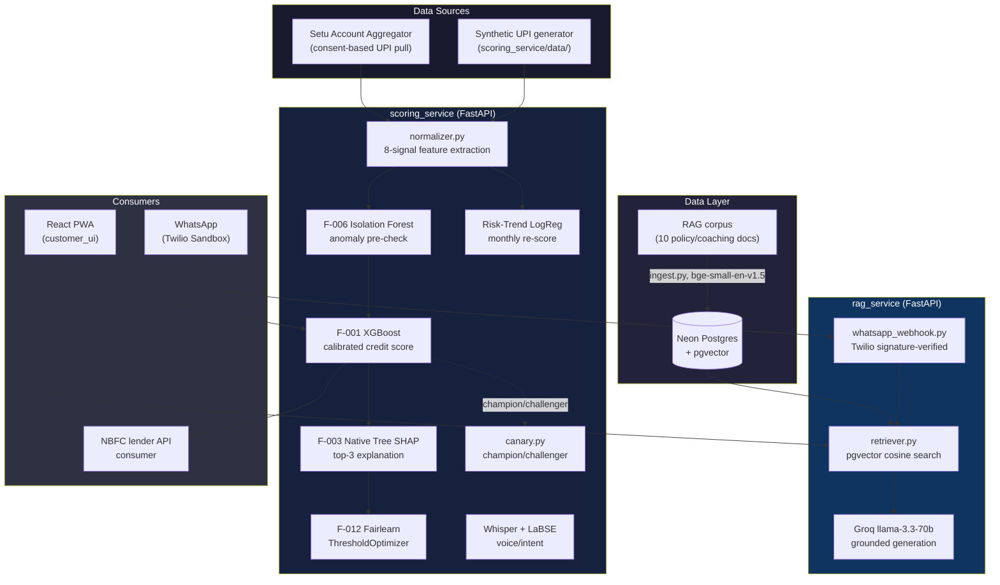
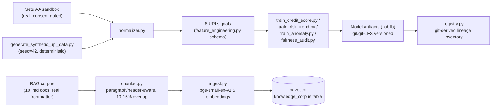

# FinBuddy — Technical Architecture

Companion to [PRD.md](PRD.md) (requirements/governance) and the root
[README.md](../README.md) (real vs. demo-grade evidence table, live URLs).
This document is organized by *how it's built*: tools, data pipeline, ML
models, MLOps. Every tool/library named below is actually in
`requirements.txt` somewhere in this repo and actually deployed — nothing
here is aspirational.

## 1. System architecture

Two independently deployed FastAPI services (separate HuggingFace Spaces,
separate Dockerfiles, separate GHCR images) plus one static PWA — not a
monolith, so a RAG-service outage never takes down real-time scoring.

## 2. Tools used, by layer

| Layer | Tool/Library | Why this one |
|---|---|---|
| API framework | FastAPI + uvicorn | Async support (needed for the RAG service's DB/LLM calls), automatic OpenAPI docs (`/docs` on both services, used directly in the demo) |
| Credit scoring model | XGBoost | Native Tree SHAP support (see F-003 row) without needing the separate `shap` package |
| Explainability | XGBoost's built-in `pred_contribs=True` | The `shap` package imports `llvmlite`/`numba`, blocked by this dev machine's Windows Application Control policy — same underlying Tree SHAP algorithm, different implementation path |
| Risk-Trend classifier | scikit-learn `LogisticRegression` | Deliberately simpler/faster than F-001 — this is a periodic portfolio-monitoring signal, not a lending decision, doesn't need XGBoost's capacity |
| Anomaly detection | scikit-learn `IsolationForest` | Unsupervised, no labeled anomaly data needed/exists |
| Fairness audit + mitigation | Fairlearn (`ThresholdOptimizer`, metrics) | Purpose-built for exactly the DPD/EOD/DIR metrics the governance spec requires, not a general stats library bolted on |
| Voice transcription | HuggingFace `transformers` pipeline, `openai/whisper-small` | Pretrained multilingual (Hindi/Tamil/English) ASR — training a Conformer from scratch was out of reach for this timeline (see PRD section 7) |
| Intent classification | `sentence-transformers` (LaBSE) + `LogisticRegression` head | LaBSE chosen after empirically testing against a weaker multilingual model that failed real Tamil test queries |
| RAG embeddings | `sentence-transformers` (`BAAI/bge-small-en-v1.5`) | English-focused, matches the English-only verified corpus (see PRD's Hindi-toggle caveat for why this matters) |
| Vector store | PostgreSQL + `pgvector` (Neon serverless) | Cosine similarity search; no `evidently`/heavier vector-DB dependency needed at this corpus size (10 documents) |
| LLM generation | Groq API (`llama-3.3-70b-versatile`) | Free-tier fast inference; genuinely measured latency numbers are in the README, not assumed |
| WhatsApp channel | Twilio WhatsApp Sandbox API | Real signature validation (`twilio.request_validator`), real TwiML replies |
| AA data source | Setu Account Aggregator API (sandbox) | Real OAuth token exchange + `/v2/consents` + `/v2/sessions` — endpoint details found empirically (see `setu_integration/client.py`'s docstring), not from incomplete public docs |
| Frontend | React 18 (CDN, Babel standalone) | No build step — the whole customer PWA is one deployable static directory |
| PWA infra | Web App Manifest + Service Worker | Installable, offline-capable app shell; API calls always network-only (see `sw.js`'s explicit host exclusion) |
| Containerization | Docker (one Dockerfile per service) | Each service independently deployable |
| Deployment | HuggingFace Spaces (Docker SDK) | Free-tier hosting for all 3 services, live URLs in README |
| Container registry | GitHub Container Registry (GHCR) | Versioned, independently pullable images, separate from the HF Spaces deploy step, using the built-in `GITHUB_TOKEN` |
| CI/CD | GitHub Actions | Gate A + Gate B tests block `build-and-deploy`; see `.github/workflows/deploy.yml` |
| Drift monitoring | Pure NumPy (PSI + CUSUM), not `evidently` | `evidently`'s `pyarrow` dependency hit the same Windows DLL block as `shap` |
| Testing | pytest + pytest-asyncio | `tests/test_mlops_gates.py` (Gate A), `tests/test_rag_pipeline.py` + `tests/test_whatsapp_webhook.py` (Gate B) |

## 3. Data pipeline

Two independent pipelines, deliberately not shared:

- **Structured (scoring) pipeline**: `generate_synthetic_upi_data.py`
  produces two deterministic CSVs (verified byte-identical across runs via
  SHA-256, since CI regenerates them rather than committing them) — one for
  F-001/F-006/F-012, one (delta-window) for Risk-Trend. `normalizer.py`
  maps real Setu FI data onto the *exact same* 8-column schema, so every
  downstream model treats a real profile identically to a synthetic one.
  See [data_catalog.md](data_catalog.md) for the full schema and every
  dataset's real provenance.
- **Unstructured (RAG) pipeline**: markdown documents with real frontmatter
  (`doc_type`, `regulator`, `legal_signoff_status`, `last_verified`) get
  chunked (never at a fixed character count — that fragments policy
  statements mid-sentence), embedded, and upserted into pgvector.
  Re-running `ingest.py` is idempotent (upsert, not append).

## 4. ML models

| Model | Algorithm | Real held-out metric | Governance gate |
|---|---|---|---|
| F-001 (champion) | XGBoost + isotonic calibration | AUC 0.8824 (target ≥0.82) | Gate A, hard-blocking |
| F-001 (challenger) | XGBoost, deeper/slower variant (`n_estimators=350, max_depth=5`) | AUC 0.881 | Not gated — shadow-tested only, see Section 5 |
| Risk-Trend | Logistic Regression (Ridge/L2) | ROC-AUC 0.9813 (target ≥0.96) | Gate A, hard-blocking |
| F-006 | Isolation Forest (`contamination=0.03`) | Precision 0.8448 / Recall 0.8909 vs. synthetic injected anomalies | No spec-defined threshold — reported for transparency, not pass/fail |
| F-012 mitigation | Fairlearn `ThresholdOptimizer` | DPD ≤0.05 and DIR ≥0.80 achieved by the **deployed** model for geography and income_band only (fit jointly on that intersection). Gender is NOT part of that fit -- its DPD/EOD still fail on the deployed model (DIR passes); a separate, undeployed isolated demo proves gender's gap is fixable on its own. See PRD section 6 for the exact figures. | Gate A, hard-blocking for geography/income_band DPD+DIR; gender DPD/EOD not gated (see PRD section 6); EOD for geography/income_band is a documented human-signoff exception |
| Intent classifier | LaBSE embeddings + Logistic Regression | 100% on a small held-out Hindi/Tamil/English set | Not gated (no spec threshold), but empirically tested before choosing LaBSE over a weaker alternative |
| ASR | Pretrained `openai/whisper-small` | Mechanically smoke-tested only (pipeline runs end-to-end) | Not gated — real speech transcription quality NOT independently verified, flagged explicitly |

F-003 (explainability) isn't a separate trained model — it's XGBoost's own
native Tree SHAP contributions on the F-001 champion, computed at
inference time (measured 36ms, target <500ms).

## 5. MLOps

- **Governance gates (CI-enforced):** Gate A (`tests/test_mlops_gates.py`)
  and Gate B (`tests/test_rag_pipeline.py` + `tests/test_whatsapp_webhook.py`)
  both must pass before `.github/workflows/deploy.yml`'s
  `build-and-deploy` job runs — a failing test blocks the live deploy
  outright, not just a logged warning.
- **Model registry:** `scoring_service/models/registry.py` — real git
  commit hash + commit date per artifact (from `git log`, not invented),
  alongside that model's real metrics. Regenerate with
  `python -m scoring_service.models.registry`.
- **Champion/challenger evaluation:** two independent angles —
  `canary.py` (shadow test: AUC/approval-rate per arm on a traffic-style
  split) and `evaluate_classification.py` (same-data comparison: full
  accuracy/precision/recall/confusion-matrix per model, plus PSI-based
  prediction drift and approve/deny decision-flip rate between the two
  models). Run: `python -m scoring_service.models.evaluate_classification`.
- **Drift monitoring:** `scoring_service/monitoring/drift_report.py` — pure
  NumPy PSI + CUSUM, three real scenarios (no/moderate/severe drift)
  against simulated "current" data (no real production traffic exists yet
  to measure real drift against — stated plainly, not hidden).
- **Audit logging:** every real-time scoring decision
  (`scoring_service/api/audit_log.py`) and every coach interaction, HTTP API
  and WhatsApp alike (`rag_service/audit_log.py`), appended to a local JSONL
  log with inputs, outputs, sources, and latency.
- **Container registry + deploy:** every push to `master` builds and
  pushes all three service images to GHCR (versioned, independently
  pullable) *and* deploys live to HuggingFace Spaces — two different,
  complementary artifacts of the same CI run.
- **Explicit maturity self-assessment:** PRD.md section 7.1 scores this
  project layer-by-layer against a standard 6-layer MLOps reference
  architecture (Governance/Monitoring/Serving/CI-CD/Development/Data) —
  strong on what's directly observable and verified live, thin on
  enterprise-platform layers (access control, alerting, a feature store)
  that assume a larger team and real production traffic. Read that section
  for what was deliberately left open and why, rather than closed
  superficially.
